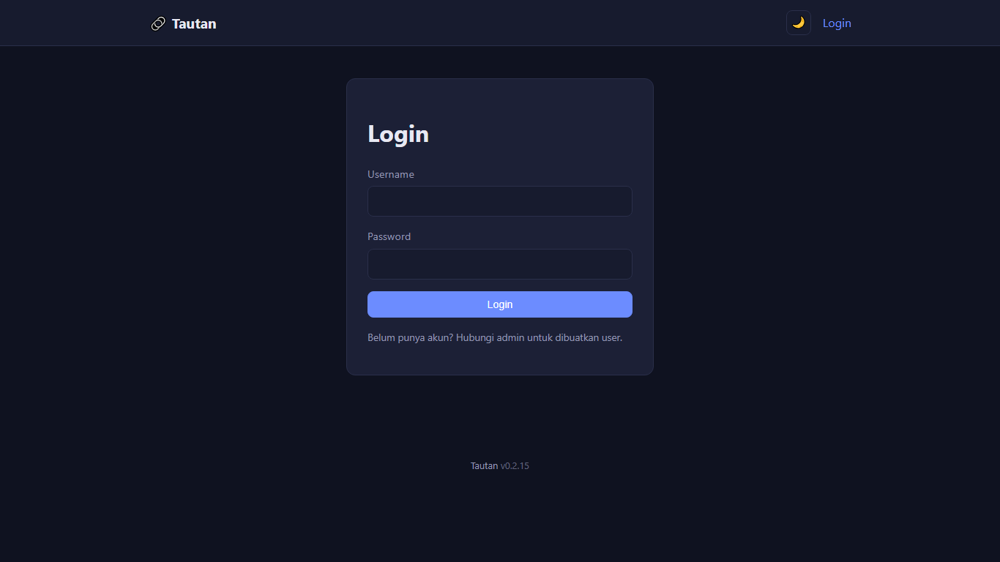

# Tautan

Aplikasi manajemen bookmark/tautan sederhana berbasis PHP + PDO SQLite.

## Fitur

- Data user & link disimpan di SQLite lewat PDO (file otomatis dibuat di `data/bookmarks.sqlite`).
- **Setup awal otomatis**: instalasi baru diarahkan ke halaman **Setup** untuk membuat akun admin pertama sendiri — tidak ada kredensial default.
- **Halaman Pengaturan** (khusus admin): kelola user, backup/restore database, dan ubah teks footer.
- **Admin**: tambah/edit/hapus user (tidak bisa menghapus diri sendiri atau admin terakhir), backup & restore database (`.sqlite`, salinan pengaman otomatis dibuat sebelum restore).
- **User login**: buat, sunting, hapus link, atur urutan lewat drag-and-drop (disimpan otomatis).
- **Tag/kategori & filter**: beri satu link beberapa tag (dipisah koma) lewat form tambah/edit, lalu filter tampilan beranda berdasarkan tag lewat bar filter atau `index.php?tag=...` — bisa dikombinasikan dengan pencarian teks (`?q=...`).
- **Ekspor daftar link**: unduh daftar link (judul, URL, deskripsi, tag, visibilitas) sebagai file `.json` atau `.csv` lewat tombol "⬇️ Ekspor" di beranda — ikut membawa filter pencarian/tag yang sedang aktif. Terpisah dari backup `.sqlite` penuh di bawah (yang isinya seluruh database, termasuk user).
- **Impor bookmark**: unggah file HTML hasil ekspor bookmark browser (Chrome/Firefox/Edge/Safari) untuk menambahkan banyak tautan sekaligus — lihat `links/import.php`.
- **Bisa di-install sebagai app**: punya web app manifest (`manifest.json`) & service worker minimal (`sw.js`), jadi bisa di-"Install app" lewat menu browser (Chrome/Edge/Safari desktop maupun Android/iOS "Add to Home Screen") dan berjalan dalam jendela sendiri tanpa address bar. Service worker sengaja cuma meng-cache aset statis (CSS/ikon), bukan halaman PHP — supaya tidak ada risiko konten sesi/privat "nyangkut" di cache.
- **Dark mode / toggle tema**: tombol 🌙/☀️ di topbar untuk beralih tema gelap (default) dan terang, tersimpan per browser lewat `localStorage`, berlaku di semua halaman.
- **Tamu (tanpa login)**: tetap bisa melihat & membuka link berstatus **publik**. Link privat hanya tampil untuk yang sudah login.
- **Cache favicon lokal**: ikon domain (fallback saat link tidak diisi ikon sendiri) diunduh sekali per domain lewat `favicon.php` dan disimpan di `data/favicons/`, bukan hotlink ke layanan favicon Google di setiap render halaman.
- **Statistik klik per link (opsional, hormati privasi)**: nonaktif secara default, diaktifkan lewat ⚙️ Pengaturan → 📊 Statistik (khusus admin). Saat aktif, tautan dibuka lewat `go.php` yang hanya mencatat jumlah klik & waktu klik terakhir per link — tanpa IP, user-agent, atau data pengunjung lain. Bisa direset kapan saja lewat tombol "Reset Statistik".
- **Multi-bahasa (ID/EN)**: tombol 🌐 ID/EN di topbar untuk mengganti bahasa antarmuka. Pilihan disimpan lewat cookie (`switch_lang.php`), berlaku juga untuk pengunjung yang belum login. Seluruh halaman & pesan flash/validasi sudah diterjemahkan; string bahasa ada di `includes/lang/id.php` & `includes/lang/en.php`.
- Proteksi dasar: password di-hash, semua query pakai prepared statement, proteksi CSRF, output di-escape (XSS-safe).

## Tangkapan Layar

**Login**



**Beranda — Daftar Tautan**


> Screenshot beranda menampilkan filter tag, pencarian, serta tombol Impor/Ekspor. Kontribusi screenshot panel Pengaturan admin masih dibuka — lihat `TODO.md`.

## Struktur Folder

```
tautan/
├── config.php              # Koneksi PDO SQLite + skema tabel otomatis
├── includes/                # Auth, helper, query, header/footer bersama
│   ├── lang.php               # Fungsi t()/current_lang() untuk multi-bahasa
│   └── lang/                  # String UI per bahasa: id.php (default), en.php
├── admin/                   # Halaman Pengaturan (khusus admin)
│   ├── settings.php          # Ringkasan
│   ├── users.php / user_form.php / user_delete.php   # Kelola user
│   ├── backup.php            # Backup & restore database
│   ├── appearance.php        # Ubah teks footer
│   └── stats.php             # Statistik klik: toggle on/off, tabel per link, reset data
├── links/                   # Aksi terkait link (khusus user login)
│   ├── form.php               # Tambah & edit link
│   ├── import.php             # Impor massal dari file HTML bookmark browser
│   ├── delete.php
│   ├── export.php             # Ekspor daftar link (JSON/CSV, terpisah dari backup .sqlite)
│   └── reorder.php            # Endpoint AJAX drag-and-drop
├── index.php                 # Daftar link (beranda)
├── login.php / logout.php / setup.php
├── switch_lang.php            # Endpoint ganti bahasa UI (set cookie tautan_lang, redirect balik)
├── favicon.php                # Endpoint cache favicon lokal (lihat data/favicons/ di bawah)
├── go.php                     # Endpoint redirect tautan (mencatat klik hanya kalau Statistik aktif)
├── manifest.json              # Web app manifest (PWA) — supaya bisa "Install app" lewat browser
├── sw.js                      # Service worker minimal (cuma cache aset statis, bukan halaman PHP)
├── assets/                   # style.css, app.js (drag-and-drop via SortableJS CDN), default-favicon.svg, icons/ (ikon PWA)
└── data/                     # bookmarks.sqlite (auto), backups/, favicons/ (cache) — jangan di-commit
```

## Kebutuhan Sistem

- **PHP 8.0+**
- **Ekstensi PHP**: `pdo`, `pdo_sqlite`, `sqlite3`, `mbstring`, dan `dom` (dipakai untuk mem-parsing file HTML saat Impor Bookmark — `dom` biasanya sudah aktif secara default di kebanyakan instalasi PHP, tapi cek `php -m` kalau fitur impor error)
- **SQLite 3** — mesin database yang dipakai aplikasi ini (via PDO, tanpa server database terpisah; file `.sqlite` dibuat & dikelola otomatis di `data/`)
- Web server: Apache (dengan `mod_rewrite`/`.htaccess` aktif) atau Nginx
- Folder `data/` harus bisa ditulis oleh user web server

Alternatif: gunakan **Docker** (lihat bagian [Menjalankan dengan Docker](#menjalankan-dengan-docker)) supaya tidak perlu menyiapkan PHP & ekstensi SQLite secara manual.

## Instalasi

1. Salin folder `tautan/` ke server PHP yang sudah memenuhi kebutuhan sistem di atas.
2. Pastikan folder `data/` bisa ditulis web server: `chmod 775 data`.
3. Akses `index.php` lewat browser — karena belum ada user, Anda otomatis diarahkan ke halaman **Setup** untuk membuat akun admin pertama.

## Menjalankan dengan Docker

Cara tercepat untuk mencoba atau menjalankan Tautan tanpa menyiapkan PHP & SQLite secara manual:

```bash
docker compose up -d --build
```

Lalu buka `http://localhost:8080`. Data (`data/bookmarks.sqlite` & `data/backups/`) disimpan di volume Docker bernama `tautan_data` sehingga tetap ada walau container dihapus/dibuat ulang. Lihat komentar di `Dockerfile` dan `docker-compose.yml` untuk detail konfigurasi (port, volume, dsb).

## Panduan Deploy ke Shared Hosting (non-Docker)

Tautan tidak butuh database server terpisah (MySQL dkk), jadi cocok untuk hosting murah/shared yang cuma menyediakan PHP — asalkan ekstensi `pdo_sqlite` & `mbstring` diizinkan aktif (lihat [Kebutuhan Sistem](#kebutuhan-sistem)). Kebanyakan panel cPanel/DirectAdmin modern sudah menyertakan keduanya secara default.

### 1. Pastikan versi & ekstensi PHP aktif

Di cPanel: buka **Select PHP Version** (kadang disebut **MultiPHP Manager**), pilih **PHP 8.0+** untuk domain/subdomain terkait, lalu di daftar ekstensi centang/pastikan aktif:

- `pdo`
- `pdo_sqlite` (kadang muncul sebagai `sqlite3`)
- `mbstring`

Kalau salah satu ekstensi itu tidak ada di daftar (jarang, tapi ada di hosting murah tertentu), hubungi support hosting untuk mengaktifkannya — Tautan tidak bisa jalan tanpanya (halaman langsung *500 Internal Server Error*).

### 2. Upload file

- Upload seluruh isi folder `tautan/` ke `public_html/` (untuk domain utama) atau `public_html/nama-subfolder/` (kalau mau di subfolder/subdomain), lewat **File Manager** atau FTP/SFTP.
- Cara tercepat: zip folder `tautan/` di komputer lokal, upload satu file zip lewat File Manager, lalu **Extract** di server — jauh lebih cepat daripada upload ratusan file satu-satu lewat FTP.

### 3. Set permission folder `data/`

Folder `data/` harus bisa ditulis oleh proses PHP (karena file `bookmarks.sqlite` dibuat & ditulis otomatis di situ). Di File Manager cPanel: klik kanan folder `data/` → **Change Permissions** → set ke **755**; kalau masih gagal menulis, naikkan ke **775** (khusus folder `data/` dan `data/backups/`, tidak perlu untuk seluruh proyek). Lewat SSH/terminal (kalau hosting menyediakan):

```bash
chmod -R 775 data
```

> Kebanyakan shared hosting menjalankan PHP lewat `suPHP`/`PHP-FPM` dengan user yang sama seperti pemilik file (bukan `www-data` terpisah seperti di server sendiri/Docker), jadi biasanya **755 sudah cukup** tanpa perlu ganti owner secara manual.

### 4. Proteksi folder `data/` (Apache)

Shared hosting berbasis cPanel/DirectAdmin hampir selalu pakai **Apache dengan `.htaccess` aktif**, jadi file `data/.htaccess` yang sudah ada di proyek ini (isinya `Require all denied`) otomatis memblokir akses langsung ke `data/bookmarks.sqlite` lewat browser — tidak perlu konfigurasi tambahan. Kalau ragu, coba akses `https://domainanda.com/data/bookmarks.sqlite` langsung di browser setelah instalasi — seharusnya muncul **403 Forbidden**, bukan file ter-download.

### 5. Jalankan Setup

Akses domain/URL proyeknya lewat browser (mis. `https://domainanda.com/`). Karena belum ada user, otomatis diarahkan ke halaman **Setup** untuk membuat akun admin pertama.

### Hal-hal yang sering jadi masalah di shared hosting

- **500 Internal Server Error langsung di halaman pertama** → hampir selalu karena ekstensi `pdo_sqlite` atau `mbstring` belum aktif di versi PHP yang dipilih untuk domain tsb. Cek lagi langkah 1.
- **"attempt to write a readonly database"** → permission folder `data/` belum tepat, atau kuota disk hosting sudah penuh (SQLite butuh ruang kosong untuk file jurnal sementara saat menulis). Cek langkah 3, lalu cek kuota disk di panel hosting.
- **`open_basedir restriction in effect`** di error log → beberapa hosting membatasi PHP hanya boleh baca/tulis di dalam folder akun sendiri. Ini normal dan tidak masalah selama seluruh folder `tautan/` (termasuk `data/`) memang ada di dalam `public_html` akun tsb.
- **File `.htaccess` di `data/` "tidak berpengaruh"** → pastikan `AllowOverride All` aktif untuk domain tsb; di shared hosting cPanel biasanya ini sudah default aktif, tapi kalau custom VPS/managed hosting, minta admin hosting mengaktifkannya.

## Backup & Restore Database

Menu **⚙️ Pengaturan → Backup / Restore** (admin):

- **Unduh Backup** — snapshot database (`.sqlite`, pakai `VACUUM INTO`) langsung diunduh. Cocok dijadwalkan lewat cron atau dijalankan manual sebelum perubahan besar.
- **Pulihkan dari Backup** — unggah file `.sqlite` untuk menggantikan database aktif. File divalidasi dulu (harus SQLite asli dengan tabel `users` & `links`), dan database aktif otomatis disalin ke `data/backups/before-restore-<tanggal>.sqlite` sebagai jaga-jaga.

⚠️ Restore **menimpa seluruh data** — pastikan file yang dipilih benar sebelum konfirmasi.

## Catatan Keamanan

- Akun admin pertama dibuat sendiri lewat halaman Setup, jadi tidak ada kredensial default yang perlu diganti. Tetap gunakan password yang kuat & unik.
- Akses langsung ke folder `data/` sudah diblokir lewat `data/.htaccess` untuk Apache. Jika deploy di Nginx, tambahkan rule serupa: `location /data/ { deny all; }`.
- Tidak ada pendaftaran akun terbuka — admin membuat akun user baru lewat menu Kelola User.
